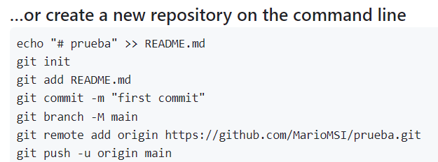

# GIT vs GITHUB 

Git es un sistema distribuido de control de versiones. 

Github es un repositorio de código cloud. 
Además de Github existe: bitbucket o gitlab. 

## The problem 

Me pasas la última versión...  

Vamos a hacer merge de nuestro código...  

Git nos permite: 
- Traquear las versiones 
- Revertir cambios hasta versiones estables 
- Seleccionar la versión con la que quieres trabajar  
- Manejar conflictos en el merge  

## Git workflow  

## Git commands 
| Comando              | Descripción breve                                                   | Ejemplo                                      |
|----------------------|---------------------------------------------------------------------|----------------------------------------------|
| `git init`           | Inicializa un nuevo repositorio Git local                           | `git init`                                   |
| `git clone [url]`    | Clona un repositorio Git desde una URL                              | `git clone https://github.com/user/repo.git` |
| `git add [archivo]`  | Agrega un archivo al área de preparación (staging area)             | `git add ejemplo.txt`                        |
| `git status`         | Muestra el estado de los archivos en el repositorio                 | `git status`                                 |
| `git commit -m "[mensaje]"` | Guarda los cambios en el repositorio con un mensaje de commit     | `git commit -m "Añade ejemplo.txt"`          |
| `git push [alias] [rama]`  | Sube los cambios al repositorio remoto                            | `git push origin master`                     |
| `git pull [alias] [rama]`  | Actualiza el repositorio local con los cambios del remoto         | `git pull origin master`                     |
| `git branch [nombre]`| Crea una nueva rama                                                 | `git branch nueva-rama`                      |
| `git checkout [nombre]`| Cambia a otra rama                                                 | `git checkout nueva-rama`                    |
| `git merge [nombre]` | Fusiona la rama especificada con la rama actual                    | `git merge nueva-rama`                       |
| `git log`            | Muestra el historial de commits                                     | `git log`                                    |
| `git fetch`          | Obtiene las últimas actualizaciones del repositorio remoto pero no las fusiona | `git fetch`                             |
| `git diff [archivo]` | Muestra las diferencias en un archivo antes de hacer commit        | `git diff ejemplo.txt`                       |

## Primera configuración
`$ git config --global user.name "Nombre-usuario"`
`$ git config --global user.email nombre@example.com`

## Principales procesos 
#### Empezar un repo de cero 
1. Voy a github y creo un nuevo repositorio. 
2. Creamos una carpeta en local, el nombre de la carpeta y el repo no tiene que coincidir. 
3. Hacemos los pasos que dice github cuando hemos creado el repo: 

Ya está nuestro repo creado! 

#### Conectarnos a un proyecto de github
1. Creamos carpeta en nuestro ordenador 
2. hacemos: `git clone [ruta del proyecto]`
3. Si queremos cargar las actualizaciones de este proyecto lo haremos con `git pull`

#### Enlace de interés 
https://antonz.org/git-by-example/